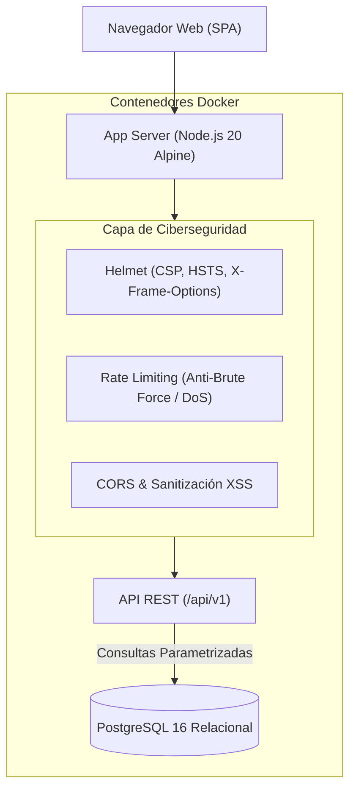

# 🛡️ Academia CiberSegura Corporación Suiche 7B (v2.0 Contenerizada)

Plataforma interactiva de entrenamiento, simulación de ataques y concienciación en ciberseguridad para el personal de **Corporación Suiche 7B**, ahora respaldada por una arquitectura empresarial en **Docker**, **Node.js (Express)** y **PostgreSQL**.

---

## 🚀 Inicio Rápido con Docker Compose

Para levantar toda la infraestructura (servidor de aplicaciones + base de datos PostgreSQL) con un solo comando:

```bash
docker compose up --build
```

Una vez que los contenedores estén listos, ingresa desde tu navegador a:
👉 **[http://localhost:3000](http://localhost:3000)**

Para detener los contenedores:
```bash
docker compose down
```

---

## 🏗️ Arquitectura de la Solución



---

## 🗄️ Base de Datos y Persistencia (PostgreSQL)

La base de datos se inicializa automáticamente mediante el script `server/db/init.sql` con las siguientes tablas:

| Tabla | Propósito |
|---|---|
| `departments` | Catálogo oficial de departamentos de Corporación Suiche 7B. |
| `users` | Registro de usuarios, departamento, puntaje acumulado y aciertos. |
| `module_progress` | Trazabilidad de cada módulo (Phishing, PCI-DSS, Incidentes, Contraseñas, USB) con estado y fechas de completado. |
| `audit_logs` | Registro inmutable de eventos de seguridad (registro, login, completado de módulos, IP y User-Agent). |

---

## 🔒 Buenas Prácticas y Controles de Ciberseguridad (OWASP)

1. **Prevención de Inyecciones SQL**: Todas las consultas a la base de datos se ejecutan utilizando sentencias preparadas y parametrizadas con el driver `pg`.
2. **Protección contra XSS (Cross-Site Scripting)**:
   - Sanitización estricta de cadenas en middleware (`validate.js`).
   - Cabeceras **Content Security Policy (CSP)** configuradas mediante `helmet`.
3. **Protección Anti-Brute Force y Mitigación de DoS**:
   - Limitadores de tasa (`express-rate-limit`) tanto globales como específicos para endpoints de autenticación y registro.
4. **Cabeceras HTTP Seguras**:
   - `X-Frame-Options: DENY` (anti-clickjacking).
   - `X-Content-Type-Options: nosniff` (previene MIME sniffing).
   - `Strict-Transport-Security` (HSTS).
5. **Principio de Mínimo Privilegio**:
   - El contenedor Docker ejecuta la aplicación bajo el usuario sin privilegios `node` (no como `root`).
6. **Trazabilidad y Auditoría**:
   - Cada acción relevante se guarda en `audit_logs` con dirección IP y marca de tiempo.

---

## 📡 Endpoints de la API REST

- `GET /health` : Verificación de estado del servidor y conexión a PostgreSQL.
- `GET /api/v1/departments` : Lista de departamentos registrados.
- `POST /api/v1/users/register` : Registro o inicio de sesión seguro de colaboradores.
- `GET /api/v1/users/:id` : Consulta del perfil y progreso del usuario.
- `POST /api/v1/progress/update` : Actualización de puntos y módulos completados.
- `POST /api/v1/progress/reset/:userId` : Reinicio controlado de progreso.
- `GET /api/v1/stats/leaderboard` : Ranking interdepartamental calculado en tiempo real.
- `GET /api/v1/stats/summary` : Métricas y auditoría general.
